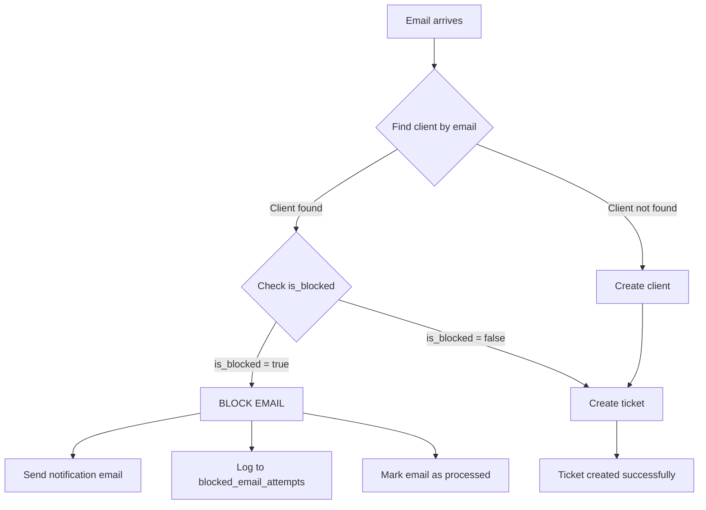

# Quick Blocked Client Testing - Manual cURL Commands

## Prerequisites
Services must be running on their default ports:
- Client Service: `http://localhost:8003`
- Email Service: `http://localhost:8005`
- Ticket Service: `http://localhost:8002`

---

## Step 1: Create a Test Client

```bash
curl -X POST "http://localhost:8003/api/v1/clients" \
  -H "Content-Type: application/json" \
  -d '{
    "email": "blocked-test@example.com",
    "name": "Blocked Test User",
    "company": "Test Company",
    "is_blocked": false
  }' | jq '.'
```

**Save the `client_id` from the response!**

---

## Step 2: Verify Client Exists (Not Blocked)

```bash
# Replace {CLIENT_ID} with actual ID from Step 1
curl -X GET "http://localhost:8003/api/v1/clients/{CLIENT_ID}" | jq '.'
```

Look for: `"is_blocked": false`

---

## Step 3: Search for Client by Email

```bash
curl -X GET "http://localhost:8003/api/v1/clients?email=blocked-test@example.com" | jq '.'
```

This confirms the client service can find the client.

---

## Step 4: Block the Client

```bash
# Replace {CLIENT_ID} with actual ID
curl -X PUT "http://localhost:8003/api/v1/clients/{CLIENT_ID}" \
  -H "Content-Type: application/json" \
  -d '{
    "is_blocked": true
  }' | jq '.'
```

**Verify the response shows: `"is_blocked": true`**

---

## Step 5: Confirm Client is Blocked

```bash
# Replace {CLIENT_ID} with actual ID
curl -X GET "http://localhost:8003/api/v1/clients/{CLIENT_ID}" | jq '.data.is_blocked'
```

Should return: `true`

---

## Step 6: Test Email Processing Directly

If your email service has a direct email-to-ticket endpoint:

```bash
curl -X POST "http://localhost:8005/api/v1/email-to-ticket/process" \
  -H "Content-Type: application/json" \
  -d '{
    "from_address": "blocked-test@example.com",
    "to_addresses": ["support@aidly.com"],
    "subject": "Test Email After Blocking",
    "body_plain": "This should be blocked and I should receive a notification.",
    "body_html": "<p>This should be blocked and I should receive a notification.</p>",
    "message_id": "test-123@example.com",
    "received_at": "2025-10-02 14:30:00"
  }' | jq '.'
```

**Expected Response:**
```json
{
  "success": false,
  "error": "Email sender is blocked: blocked-test@example.com"
}
```

---

## Step 7: Check Application Logs

```bash
# In email service directory
cd /root/AidlY/services/email-service
tail -f storage/logs/lumen.log | grep -i "blocked"
```

**Expected Log Entries:**
```
[WARNING] Blocked email from blocked client - Auto-reply sent
{
  "client_id": "abc-123",
  "client_email": "blocked-test@example.com",
  "notification_sent": true
}
```

---

## Step 8: Query Blocked Attempts Log (If endpoint exists)

```bash
curl -X GET "http://localhost:8005/api/v1/blocked-attempts?email=blocked-test@example.com" | jq '.'
```

**Expected Response:**
```json
{
  "success": true,
  "data": [
    {
      "id": "uuid-here",
      "client_id": "client-uuid",
      "email_address": "blocked-test@example.com",
      "subject": "Test Email After Blocking",
      "notification_sent": true,
      "block_reason": "Client is blocked in system",
      "attempted_at": "2025-10-02 14:30:00"
    }
  ]
}
```

---

## Step 9: Check Database Directly

```bash
# Connect to PostgreSQL
docker exec -it aidly-postgres psql -U aidly_user -d aidly

# Check blocked attempts table
SELECT * FROM blocked_email_attempts
WHERE email_address = 'blocked-test@example.com'
ORDER BY attempted_at DESC;

# Check client is blocked
SELECT id, email, name, is_blocked FROM clients
WHERE email = 'blocked-test@example.com';
```

---

## Step 10: Test Ticket Creation (Should Fail)

Try creating a ticket via the public endpoint:

```bash
curl -X POST "http://localhost:8002/api/v1/public/tickets" \
  -H "Content-Type: application/json" \
  -d '{
    "subject": "Test Ticket from Blocked Client",
    "description": "This should work if created directly via API (not email)",
    "client_email": "blocked-test@example.com",
    "source": "email",
    "priority": "medium"
  }' | jq '.'
```

**Note:** The ticket service itself may not check blocking - only email-to-ticket conversion does!

---

## Step 11: Unblock the Client (Cleanup)

```bash
# Replace {CLIENT_ID} with actual ID
curl -X PUT "http://localhost:8003/api/v1/clients/{CLIENT_ID}" \
  -H "Content-Type: application/json" \
  -d '{
    "is_blocked": false
  }' | jq '.'
```

---

## Step 12: Delete Test Client (Cleanup)

```bash
# Replace {CLIENT_ID} with actual ID
curl -X DELETE "http://localhost:8003/api/v1/clients/{CLIENT_ID}" | jq '.'
```

---

## Alternative: Test via Database Directly

### Block a client by email:
```sql
UPDATE clients
SET is_blocked = true
WHERE email = 'blocked-test@example.com';
```

### View all blocked clients:
```sql
SELECT id, email, name, is_blocked, created_at
FROM clients
WHERE is_blocked = true;
```

### View blocked email attempts:
```sql
SELECT
  email_address,
  subject,
  notification_sent,
  block_reason,
  attempted_at
FROM blocked_email_attempts
ORDER BY attempted_at DESC
LIMIT 10;
```

---

## Testing the Notification Email

The blocked sender should receive an email with:

**Subject:** `Message Delivery Failed - Account Restricted`

**Content includes:**
- ⚠️ Warning that account is restricted
- Original email subject
- Reasons for blocking
- Contact information
- Professional formatting

---

## Troubleshooting

### Email not blocked?
1. Check client service is running: `curl http://localhost:8003/health`
2. Verify client is actually blocked: `SELECT is_blocked FROM clients WHERE email = '...'`
3. Check email service logs: `tail -f services/email-service/storage/logs/lumen.log`

### Notification email not sent?
1. Check SMTP configuration in `.env`
2. Check email service logs for "Failed to send blocked sender notification"
3. Verify mailer is configured: `php artisan tinker` → `app('mailer')`

### Database errors?
1. Run migration: `cd services/email-service && php artisan migrate`
2. Check table exists: `\dt blocked_email_attempts` in psql

---

## Expected Workflow



---

## Quick One-Liner Tests

```bash
# Check if client is blocked
curl -s "http://localhost:8003/api/v1/clients?email=blocked-test@example.com" | jq '.data[0].is_blocked'

# Count blocked attempts
curl -s "http://localhost:8005/api/v1/blocked-attempts" | jq '.data | length'

# Check recent logs
docker logs aidly-email-service 2>&1 | grep -i "blocked" | tail -5
```

---

## Success Indicators

✅ **Client is blocked:** `is_blocked = true` in database
✅ **Email rejected:** Error message contains "blocked"
✅ **Notification sent:** Log shows "Sent blocked sender notification"
✅ **Attempt logged:** Entry in `blocked_email_attempts` table
✅ **No ticket created:** Ticket count doesn't increase

---

## Production Considerations

1. **Rate Limiting:** Prevent blocked users from flooding with attempts
2. **Notification Throttling:** Don't send notification for every attempt (once per day max)
3. **Admin Alerts:** Notify admins when blocked users repeatedly try to contact
4. **Appeal Process:** Provide way for users to appeal blocks
5. **Auto-Expire:** Consider auto-unblocking after X days
